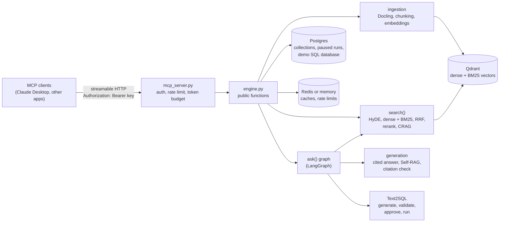
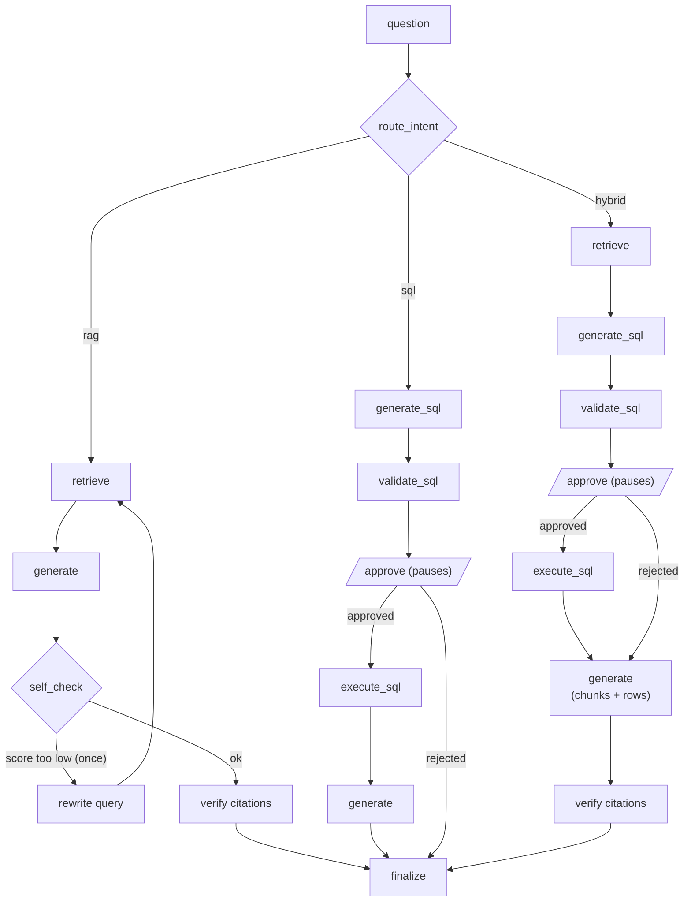

# RAG-Engine

A reusable retrieval-augmented generation (RAG) engine, exposed as an **MCP server**. Applications
put documents into *collections* and ask questions over them; the Engine answers with numbered
citations it has checked against the sources. When a collection is linked to a SQL database, it can
also answer data questions with Text2SQL, but only after a human approves the generated query.

It is built as one clear implementation of each advanced RAG technique, so each part can be read
and explained on its own:

- **Hybrid search**: dense embeddings plus BM25 keyword vectors in Qdrant, merged with Reciprocal
  Rank Fusion (RRF), then reranked by a cross-encoder.
- **HyDE**: hypothetical answers help the dense search find paraphrased questions.
- **CRAG**: every retrieved chunk is graded; weak chunks are dropped, and a web search (optional)
  fills the gap when nothing relevant is left.
- **Self-RAG**: the answer is scored for groundedness and completeness, with one retry using a
  rewritten search query.
- **Citation verification**: each statement is checked against the passages it cites; unsupported
  statements are removed (or flagged, in strict mode).
- **Text2SQL with approval**: an intent router picks documents, SQL or both; SQL is validated,
  paused for approval, and run read-only with a timeout.
- **Guardrails**: API keys, input validation and scanning, rate limits, token budgets, spotlighting
  of untrusted content, and output moderation with PII redaction.
- **Caching, tracing and evaluation**: five cache tiers, LangSmith traces of every step, and an
  evaluation harness with retrieval metrics, Ragas and a Text2SQL execution check.

## Architecture



Every capability is a plain Python function (`search`, `rerank`, `grade_chunks`,
`generate_answer`, `verify_citations`, `generate_sql`, `run_sql`, `ingest_document`, ...). The
LangGraph graph behind `ask()` only decides the order; each node calls one of those functions.

### How `ask()` answers a question



A SQL or hybrid question returns `status: "pending_sql"` with the query and a plain-English
explanation. The caller shows it to a person and then calls `approve_sql`. The paused run is kept in
Postgres for up to 24 hours, and only the caller who asked can approve it.

## Quick start

Needs Docker, [uv](https://docs.astral.sh/uv/) and an OpenAI API key.

```bash
cp .env.example .env                        # add OPENAI_API_KEY and replace the ENGINE_API_KEYS values
uv sync                                     # install
docker compose up -d qdrant postgres        # Qdrant + Postgres (Engine database and demo SQL data)
uv run python scripts/seed_demo.py          # create and ingest the k8s-demo collection
docker compose up -d --build engine         # the MCP server on http://localhost:8000/mcp
```

Building the `engine` image downloads about 1.5 GB of local models (reranker, BM25, guardrail
classifiers, Docling's layout models) into the image, so the server starts without downloading
anything. To run the server without Docker instead: `uv run python -m rag_engine.mcp_server`.

### Connect Claude Desktop

Claude Desktop reaches the HTTP server through `mcp-remote`. Add this to the `mcpServers` object in
`~/Library/Application Support/Claude/claude_desktop_config.json` and restart Claude Desktop:

```json
"rag-engine": {
  "command": "npx",
  "args": ["-y", "mcp-remote@0.14.3", "http://localhost:8000/mcp", "--header", "Authorization:${AUTH_HEADER}"],
  "env": { "AUTH_HEADER": "Bearer <one of your ENGINE_API_KEYS>" }
}
```

Then ask, for example, *"Using rag-engine, how many P1 incidents are there per cluster environment
in k8s-demo?"*. Claude shows the SQL, and runs it only after you agree. The MCP Inspector
(`npx @modelcontextprotocol/inspector`, Streamable HTTP, same header) is handy for trying single tools.

## MCP tools

| Tool | What it does |
|---|---|
| `health` | Postgres, Qdrant and Redis status. No API key needed, no paid calls. |
| `create_collection`, `update_collection`, `list_collections`, `delete_collection` | Manage collections and their settings. |
| `ingest_document` | Add or update a document (PDF, DOCX, HTML, Markdown, TXT, ...; up to 20 MB) as base64, or a server-side path inside `INGEST_DIR`. Unchanged content is skipped. |
| `list_documents`, `delete_document` | Manage a collection's documents. |
| `search` | Ranked passages with fused, rerank and relevance-grade scores; optional metadata filters. |
| `rerank` | Rerank passages the caller already has (for example live results from another system). |
| `verify_citations` | Check caller-supplied statements against caller-supplied passages. |
| `ask` | A cited answer; may return `pending_sql`. |
| `approve_sql` | Run or reject the SQL of a paused `ask`. |

Every tool except `health` needs `Authorization: Bearer <key>`. The key's name in `ENGINE_API_KEYS`
is the *caller*, used for rate limits, token budgets, tracing tags and ownership of paused runs.

## Collections and settings

Every chunk carries its `collection_id` and every search filters on it, so collections never see
each other's documents. Each collection has its own settings; `search` and `ask` accept per-call
`options` that override any of them for one call.

| Setting | Default | Meaning |
|---|---|---|
| `search_mode` | `hybrid` | `dense`, `sparse` (BM25) or `hybrid` |
| `top_k` / `fetch_k` | 5 / 20 | chunks returned / candidates per search leg |
| `rrf_k` | 60 | RRF constant: score = Σ 1 / (rrf_k + rank) |
| `rerank`, `reranker` | on, `local` | cross-encoder (`local`) or Voyage |
| `hyde` | off | hypothetical-answer embeddings for the dense leg |
| `crag`, `crag_threshold`, `crag_web_fallback` | on, 0.5, off | per-chunk grading; optional Tavily web search |
| `self_rag`, `self_rag_threshold` | off, 0.7 | answer self-check with one retry |
| `citation_mode` | `verify` | `verify` removes unsupported statements, `strict` flags them |
| `domain_description` | "" | inserted into prompts where domain context helps |
| `sql_database`, `sql_allowed_tables` | none | enables Text2SQL on these tables only |
| `filterable_fields` | [] | metadata keys `search` can filter on (exact match or any-of) |

The defaults for reranking, CRAG, HyDE and Self-RAG follow the [evaluation](#evaluation) results.

## Guardrails

| Layer | What it does | Where |
|---|---|---|
| API keys | One key per caller; fails closed | MCP server |
| G1 validation | Length ≤ 2000 characters, obvious injection phrases | `ask`, `search` |
| G2 input scan | Prompt-injection and toxicity classifiers (Hugging Face models) | `ask`, `search` |
| G3 rate limit | Sliding window per caller (default 100 requests/minute) | every tool except `health` |
| G4 token budget | Daily tokens per caller, counted from actual usage | `search`, `verify_citations`, `ask`, `approve_sql` |
| G5 spotlighting | Retrieved text and SQL rows are delimited as untrusted data in every prompt | generation, grading, verification |
| G6 output checks | Toxicity check and redaction of emails, phone numbers, SSNs and card numbers | every final answer |

Blocked requests return a short reason (`status: "blocked"` for `ask` and `approve_sql`).

Text2SQL has its own layers: the model only sees the allowed tables; the SQL must be a single
`SELECT` (checked on the parsed syntax tree, including CTEs and subqueries) that reads only allowed
tables; it runs as a read-only database role, in a read-only transaction, with a 5-second timeout
and at most 200 rows.

## Caching

| Tier | Key | Lifetime |
|---|---|---|
| Embeddings | model + text | 7 days |
| Intent | collection + allowed tables + question | 24 hours |
| SQL generation | database + allowed tables + question | 24 hours |
| SQL results | database + normalized SQL | 15 minutes |
| Answers | collection + collection version + question + effective options | 1 hour |

The collection version changes on every ingest or delete, so stale answers are never served. Only
document answers are cached: SQL and hybrid answers always go through approval. The cache uses
Upstash Redis when configured and an in-memory store otherwise.

## Evaluation

The evaluation runs 40 golden questions against the `k8s-demo` collection under eight
configurations ("profiles"), from plain dense search to every technique switched on.

```bash
uv run python scripts/build_noise_corpus.py   # 150 Wikipedia articles as noise (titles in eval/noise_titles.txt)
uv run python scripts/seed_demo.py            # ingest them next to the 47 Kubernetes docs
uv run python eval/run_eval.py                # all profiles, the rrf_k sweep and Ragas; writes eval/results/summary.md
uv run python eval/diff.py <old.json> <new.json>   # compare two runs
```

**Data.** 47 Kubernetes documentation pages plus 150 unrelated Wikipedia articles, so that
retrieval has to find the right page among noise. The questions (`eval/goldens.yaml`) cover
direct and paraphrased document questions, vague questions, exact-term questions, 5 SQL
questions, 4 questions that need both SQL and documents, and 4 questions the documents cannot
answer (the web fallback's job). Every question has a short reference answer written from its
source document; SQL questions also have a reference query.

**Metrics.** recall@5 and MRR on source documents; the Ragas metrics faithfulness, answer
relevancy, context precision and context recall (judged by `gpt-4o-mini`); SQL execution match
(the generated query must return the reference query's rows); and whether web-only questions were
handled correctly (answered from the web when the fallback is on, flagged as insufficient when it
is off). Answers are generated with `gpt-4o`.

| profile | recall@5 | MRR | faithfulness | answer relevancy | context precision | context recall | SQL match | web handled | latency | tokens / question |
|---|---|---|---|---|---|---|---|---|---|---|
| dense | 0.769 | 0.707 | 0.922 | 0.743 | 0.786 | 0.847 | 100% | 100% | 4.6 s | 2,720 |
| sparse (BM25) | 0.661 | 0.617 | 0.920 | 0.781 | 0.726 | 0.833 | 100% | 100% | 2.8 s | 2,405 |
| hybrid | 0.726 | 0.683 | 0.936 | 0.744 | 0.770 | 0.824 | 100% | 100% | 2.9 s | 2,400 |
| **hybrid + rerank** | **0.823** | 0.801 | **0.944** | 0.772 | 0.797 | 0.870 | 100% | 100% | 3.1 s | 2,433 |
| + HyDE | 0.823 | 0.801 | 0.933 | 0.779 | 0.776 | **0.884** | 100% | 100% | 4.9 s | 2,700 |
| + CRAG (web fallback on) | 0.823 | **0.817** | 0.939 | **0.788** | 0.823 | 0.875 | 100% | 100% | 5.2 s | 3,778 |
| + Self-RAG | 0.806 | 0.801 | 0.929 | 0.746 | 0.802 | 0.866 | 100% | 100% | 4.3 s | 3,940 |
| all techniques | 0.806 | 0.817 | 0.933 | 0.779 | **0.847** | 0.861 | 100% | 100% | 7.7 s | 5,473 |

What the numbers show, and the defaults that follow from them:

- **Reranking is the biggest single gain.** Adding the cross-encoder to hybrid search lifts recall@5
  from 0.726 to 0.823 and MRR from 0.683 to 0.801, and gives the most faithful answers (0.944), for
  about 0.3 s more per question. Reranking is on by default.
- **Hybrid search needs the reranker.** On its own, hybrid is slightly behind dense search (0.726
  vs 0.769 recall), because BM25 also pulls in keyword matches from the noise articles. With the
  reranker sorting the combined candidates, hybrid is the best retrieval setup, so the default is
  `hybrid` with reranking.
- **HyDE brings no benefit on this set.** Recall and MRR are identical to hybrid + rerank, faithfulness
  is a little lower (0.933 vs 0.944), and each question takes 1.7 s longer and 11% more tokens.
  The questions are close enough to the documents' wording that hypothetical answers add nothing
  the reranker does not already fix. `hyde` is off by default.
- **Self-RAG costs without benefit on this set.** Recall, faithfulness and answer relevancy are all
  slightly lower, and it uses 62% more tokens: most first answers already pass the self-check, so
  the retry rarely changes anything. `self_rag` is off by default.
- **CRAG earns its place.** Dropping weakly relevant chunks gives the best MRR and answer relevancy
  and better context precision (0.823 vs 0.797), and it is what detects "not in the
  documents" and triggers the web fallback. It costs about 2 s per question. CRAG is on by default.
- **`rrf_k` does not matter here.** Values of 10, 60 and 120 give identical top-5 documents
  (recall 0.726, MRR 0.683 for plain hybrid), so the default stays at the usual 60.
- **Plain chunk text beats chunk text with section headings.** Prefixing every chunk with its
  heading path (Docling's `contextualize()`) lowered recall@5 from 0.823 to 0.758 on hybrid +
  rerank and used 15% more tokens, so chunks are embedded as plain text.
- **Text2SQL and the web fallback were right every time.** Every SQL and hybrid question returned the
  reference query's rows, and every web-only question was handled correctly, in every profile.

Caveats: this is one run of 40 questions, and LLM-judged scores vary a little between runs.
Ragas scores cover all 36 answerable questions in every profile (the 4 web-only questions are
checked by the "web handled" column instead). A full run costs about $2.40 (answers $1.67,
Ragas $0.69) and takes about 50 minutes, plus scoring; `run_eval.py --rescore` fills in any
scores that API timeouts leave missing.

## Design decisions

- **Plain functions first, graph second.** Every step works and is tested without LangGraph; the
  graph only orders them, which keeps each technique easy to read and to reuse from other apps.
- **One Qdrant collection, filtered by `collection_id`.** Simpler than one Qdrant collection per
  Engine collection, and isolation is enforced (and tested) on every query.
- **BM25 as sparse vectors in Qdrant** instead of rebuilding a keyword index per query. Qdrant
  applies the IDF weighting, so dense and keyword search share one store.
- **RRF written by hand** (a few lines in `retrieval/fusion.py`) rather than Qdrant's built-in
  fusion, so the fusion logic is visible and tunable (`rrf_k`).
- **Structured outputs everywhere.** Answers, grades and checks are Pydantic schemas filled by the
  model, so there is no JSON parsing or retry loop. Answers are lists of cited statements, which
  makes removing an unsupported claim as simple as dropping a statement.
- **Human approval for all SQL.** The graph pauses before any query runs; answers that used SQL are
  never cached, so nobody receives data from a query they did not see.
- **Guardrail models without llm-guard.** The prompt-injection and toxicity models are the same ones
  llm-guard uses, loaded directly with `transformers`, because llm-guard pins an old `transformers`
  version that conflicts with the rest of the stack.
- **Fail open with a visible warning** when an optional step fails (a guardrail model, HyDE, CRAG,
  the self-check or verification): the request continues and the result says what was skipped.
  API-key checks always fail closed.
- **Stateless Engine.** It stores documents, settings, caches, counters and runs paused for
  approval, but no users, conversations or memory; those belong to the applications that call it.

## Deployment

The Engine runs anywhere the Docker image runs. The hosted setup uses Railway for the Engine and
Postgres, Qdrant Cloud for vectors and Upstash for Redis. `railway.json` tells Railway to build the
`Dockerfile`, check `/healthz` and redeploy on every push to `main` that touches the code.

1. **Services.** Create a Railway project with this repository as a service plus a Postgres
   database, a Qdrant Cloud cluster and an Upstash Redis database.
2. **Postgres.** Create the Engine database and the demo SQL data, using Railway's public
   Postgres URL:
   ```bash
   psql "$ADMIN_URL" -c "CREATE DATABASE rag_engine" -c "CREATE DATABASE k8s_ops"
   psql "$ADMIN_URL_K8S_OPS" -q -f data/sql/001_k8s_ops.sql
   psql "$ADMIN_URL_K8S_OPS" -v readonly_password="$READONLY_PASSWORD" -f data/sql/002_readonly_role.sql
   ```
3. **Variables.** Set the same variables as `.env.example` on the Railway service:
   `OPENAI_API_KEY`, `QDRANT_URL` and `QDRANT_API_KEY`, `DATABASE_URL` and `SQL_DATABASES`
   (Railway's private Postgres URLs), the Upstash URL and token, `ENGINE_API_KEYS` (new random
   keys), `DAILY_TOKEN_BUDGET`, the LangSmith settings and `MCP_ALLOWED_HOSTS` (the public
   hostname). Keep a copy in `.env.production`, which is gitignored, with the public Postgres URLs.
4. **Seed** the demo collection from your machine (the Kubernetes documents only):
   ```bash
   uv run --env-file .env.production python scripts/seed_demo.py --no-noise
   ```
5. **Domain.** Add the custom domain to the Railway service and create both DNS records it
   shows (a CNAME and a TXT record). Behind Cloudflare's proxy, set SSL/TLS to *Full*.
6. **Connect** Claude Desktop as above, with `https://<your domain>/mcp` as the URL and one of the
   production keys.

## Development

```bash
uv run pytest                     # unit tests (no services needed)
uv run pytest -m integration      # needs docker compose up -d qdrant postgres
uv run pytest -m llm              # calls the OpenAI API (costs a little)
uv run ruff check .
```

Tracing: set `LANGSMITH_TRACING=true` and `LANGSMITH_API_KEY` in `.env` to see every step of every
request in LangSmith, tagged with the caller and collection. Without a key, tracing is off.

```
src/rag_engine/
  engine.py          public functions (used by the MCP server)
  mcp_server.py      MCP tools, auth and caller guardrails
  collections.py     collection and document records (Postgres)
  ingestion/         Docling parsing, chunking, the ingest pipeline
  retrieval/         embeddings, Qdrant, RRF, HyDE, reranking, search()
  grading/           CRAG, Self-RAG, citation verification
  generation/        prompts and cited answers
  sql/               schema description, Text2SQL, safety checks, read-only execution
  routing/           intent router
  graph/             the ask() graph: state, nodes, wiring
  guardrails/        API keys, input and output checks, rate limit, token budget, spotlighting
  cache/             cache store and keys
eval/                goldens, metrics, profiles, run_eval.py, diff.py
scripts/             seed_demo.py, build_noise_corpus.py, download_models.py
data/                demo documents and SQL
```

## Data and licenses

- `data/k8s_docs/` contains 47 pages from the [Kubernetes documentation](https://kubernetes.io/docs/),
  © The Kubernetes Authors, licensed under [CC BY 4.0](https://creativecommons.org/licenses/by/4.0/).
  They form the `k8s-demo` collection used for the demo and the evaluation.
- The evaluation's noise documents are Wikipedia articles, downloaded on demand by
  `scripts/build_noise_corpus.py` and not included in this repository (Wikipedia text is licensed
  under [CC BY-SA 4.0](https://creativecommons.org/licenses/by-sa/4.0/)). Their titles are listed in
  `eval/noise_titles.txt`.
- `data/sql/001_k8s_ops.sql` is synthetic Kubernetes operations data for the Text2SQL demo.
